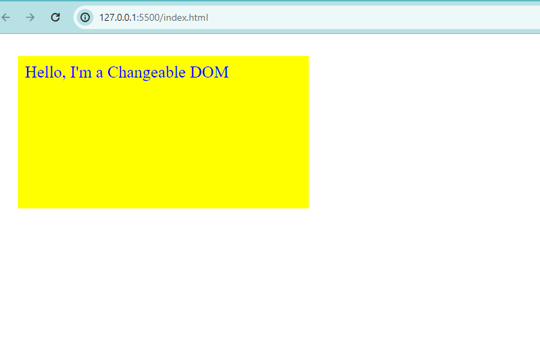
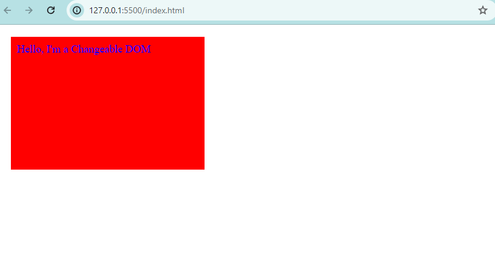

# DOM Project Manupulation

### Repo Link: https://github.com/greatlalbabu/dom
### Hosted Link: https://greatlalbabu.github.io/dom/

## Description

The project involves dynamically modifying the appearance and style of a specific HTML div element using the Document Object Model (DOM). Through JavaScript, the program targets the div and adjusts properties such as color, background color, margin, padding, font size, font weight, height, and width. This task leverages the DOM's capability to interact with and manipulate the structure and style of web page elements, providing a dynamic and responsive user interface.

### Original Image(DIV)

### after DOM Manupulation

# JS Code

let div = document.getElementById("myDiv");

div.style.backgroundColor="red";
div.style.margin="20px";
div.style.padding="10px";
div.style.fontSize="18px";
div.style.fontweight="bold";
div.style.height="200px";
div.style.width="300px";